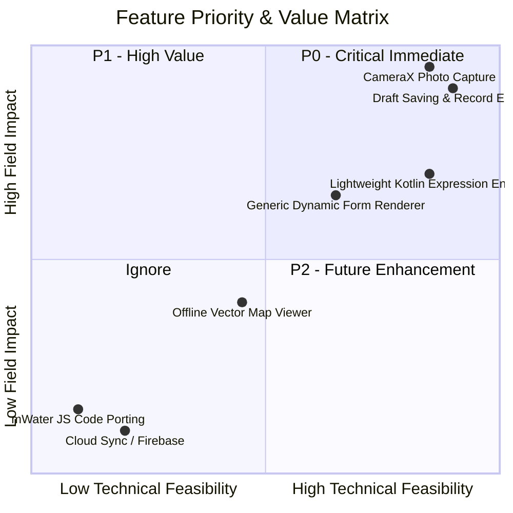

# MWATER_REFERENCE_AUDIT.md
# Yemen Water Survey Field Application — Current State Audit & mWater Reference Analysis

**Date:** 2026-08-31  
**Project:** Yemen Water Survey (`com.yemen.watersurvey`)  
**Target Platform:** Native Android (Kotlin, Jetpack Compose, Material 3, Room SQLite, 100% Offline-First)  
**Status:** Audit Completed — Read-Only Analysis (Zero Application Code Changes)  

---

## 1. Executive Summary

This audit establishes the exact current implementation state of the **Yemen Water Survey Field Application** across all functional areas and evaluates select open-source components from the **mWater platform** (`mwater-forms`, `mwater-expressions`, `offline-leaflet-map`).

### Key Findings:
1. **Core Offline Baseline is Strong:** The application possesses a fully functional, field-tested native Android core with a strict GPS accuracy gate (< 15 m), 4-tier OCHA administrative cascading hierarchy with Point-in-Polygon (PIP) spatial verification, Room database persistence, multi-sheet OOXML Excel generation, stamped PDF generation, supervisor SHA-256 `.ywsync` synchronization with merge conflict review, and product flavors (`enumerator` vs. PIN-protected `supervisor`).
2. **Current Form Architecture is Dedicated/Semi-Static:** Survey forms for Wells, Springs, and Dams are implemented as dedicated Jetpack Compose screens (`NewWellSurveyScreen`, `NewSpringSurveyScreen`, `NewDamSurveyScreen`). Package management (`FormPackageManager`) handles versioning, validation, and metadata, but there is no runtime dynamic question-tree renderer, expression evaluator, or repeat group engine.
3. **mWater Technical & Legal Suitability:** mWater components are written in TypeScript/React/Cordova under the **LGPL-3.0** license. Direct code reuse is technically incompatible with our native Kotlin/Jetpack Compose architecture and legally restrictive. However, the architectural design of `mwater-expressions` (AST-based expression evaluation) provides a clean reference model for an independent, lightweight, pure-Kotlin expression evaluator.
4. **Primary Operational Gaps:** The two most significant field-operation gaps are:
   - **Attachments / CameraX:** Attachment database models and sync packaging exist, but CameraX capture, image compression, and file storage are completely unimplemented.
   - **Draft Lifecycle & Record Reopening:** Surveys are saved immediately as `COMPLETED` without draft saving, local editing, or revision creation from `RecordsManagerScreen`.

---

## 2. Current Application Audit & Gap Analysis

| Area | Current Implementation | Evidence / Files | Status |
| :--- | :--- | :--- | :--- |
| **Dynamic Forms** | Dedicated Compose forms for Wells, Springs, and Dams. `FormPackageManager` validates zip/folder packages (`metadata.json`, `form_definition.json`, `choices.json`, `sequence_pool.json`, `pdf_mapping.json`). No generic runtime question renderer or XLSForm expression engine. | `FormPackageManager.kt` `FormManagementScreen.kt` `NewWellSurveyScreen.kt` `NewSpringSurveyScreen.kt` `NewDamSurveyScreen.kt` `SurveyViewModel.kt` | **PARTIAL** |
| **GPS Integration** | High-accuracy `FusedLocationProviderClient` with `callbackFlow`, real-time coordinate streaming, distance filtering (0.5 m), altitude capture, and UI status updates. | `GpsCaptureManager.kt` `GpsCaptureState.kt` `GpsCaptureViewModel.kt` | **COMPLETE** |
| **GPS Accuracy Gate** | Strict enforcement: Save button disabled in UI and save rejected in ViewModel if `accuracyM >= 15.0f` or GPS is null. Clear Arabic feedback displayed. | `GpsCaptureState.kt` (L17) `SurveyViewModel.kt` (L164–174) `NewWellSurveyScreen.kt` (L196) | **COMPLETE** |
| **Survey Persistence** | UUID generation, deterministic sequence pool allocation (`YE<adm1><adm2><adm3>-<type>-<seq>`) with `PENDING` offline fallback, Room persistence with JSON detail columns. | `SurveyRecordEntity.kt` `SurveyRecordDao.kt` `RegistryCodeGenerator.kt` `SurveyViewModel.kt` | **COMPLETE** |
| **Drafts & Editing** | Save logic hardcodes `workflowStatus = "COMPLETED"`. `RecordsManagerScreen` displays saved records in a read-only list. No "Save as Draft", survey re-opening, or local revision creation from UI. | `RecordsManagerScreen.kt` `SurveyViewModel.kt` (L262) | **MISSING** |
| **Admin Hierarchy** | 4-tier hierarchy: Governorate (22) $\rightarrow$ District (333) $\rightarrow$ Uzlah (2,146) $\rightarrow$ Village (41,494). OCHA P-codes + Yemen-Info enrichment. Lazy-loaded cascading dropdowns. | `AdminCascadingSelector.kt` `AdminReferenceDao.kt` `Admin1Entity.kt` .. `VillageEntity.kt` | **COMPLETE** |
| **Admin Spatial Resolver** | 2D Ray-Casting Point-in-Polygon (PIP) with $O(1)$ bounding-box pre-filtering against TopoJSON geometries in Room; Haversine nearest-village calculation. | `GpsAdministrativeResolver.kt` `TopoJsonIngestionEngine.kt` `AdminGeometryDao.kt` | **COMPLETE** |
| **Attachments (Camera)** | Room entity (`SurveyAttachmentEntity`), DAO, domain models, and sync export packaging exist. However, CameraX integration, photo capture UI, image compression, and disk storage are not implemented. | `SurveyAttachmentEntity.kt` `SurveyAttachmentDao.kt` `AndroidManifest.xml` (Camera perm only) | **PARTIAL / MISSING** |
| **Excel Export** | Native OOXML (.xlsx) builder creating genuine zip packages with 4 worksheets (Wells, Springs, Dams, Survey Log), formatting, RTL Arabic headers, and metadata. | `ExcelExporter.kt` `ExportScreen.kt` | **COMPLETE** |
| **PDF Generation** | Native Android `PdfDocument` engine stamping survey data onto vector templates using coordinate mappings (`well_mapping.json`, etc.) with Arabic text shaping. | `PdfStampingEngine.kt` `PdfMappingModels.kt` | **COMPLETE** |
| **Offline Sync (.ywsync)** | Comprehensive `.ywsync` (ZIP) exporter/importer with `manifest.json`, `surveys.json`, `revisions.json`, `metadata.json`, and `checksum.sha256`. Conflict detection engine & controlled merge review. | `SurveySyncExporter.kt` `SurveySyncImporter.kt` `ConflictDetectionEngine.kt` `ControlledMergeExecutor.kt` | **COMPLETE** |
| **Application Flavors** | Product flavors `enumerator` (`.field`) and `supervisor` (`.supervisor`). Supervisor app enforces mandatory salted SHA-256 PIN lock on every cold start via `EncryptedSharedPreferences`. | `build.gradle.kts` `MainActivity.kt` `PinLockManager.kt` `DashboardScreen.kt` | **COMPLETE** |

---

## 3. Selective Study of mWater Repositories

### 3.1 `mwater-forms`
- **Architecture:** Web/Cordova client component library designed around an XForms/JSON schema.
- **Model:** Questions are structured in a hierarchical JSON document with defined question types (`text`, `number`, `select`, `select_multiple`, `location`, `photo`, `date`, `group`, `repeat`).
- **Validation & Logic:** Rules and relevancy conditions are declared as expressions evaluated against form response state.
- **Form State Handling:** Form data is held as a nested JSON object and updated reactively on input change.
- **Key Takeaway:** Demonstrates clean separation between form definition schema and response data, but relies heavily on JavaScript/Web DOM rendering.

### 3.2 `mwater-expressions`
- **Architecture:** Standalone expression engine compiling/interpreting expressions over tabular and JSON row data.
- **Syntax:** JSON-based Abstract Syntax Tree (AST). For example:
  - Arithmetic: `{ type: "op", op: "+", exprs: [ { type: "field", column: "depth" }, 5 ] }`
  - Comparison: `{ type: "op", op: ">", exprs: [ { type: "field", column: "flowRate" }, 0 ] }`
  - Boolean Logic: `{ type: "op", op: "and", exprs: [...] }`
- **Core Components:**
  - `ExprCompiler`: Translates AST expressions into SQL / JsonQL for backend querying.
  - `ExprEvaluator`: In-memory JavaScript tree interpreter evaluating expressions against row dictionaries.
  - `ExprUtils`: Helper utilities for schema introspection, type checking, and dependency extraction.
- **Key Takeaway:** The AST representation is clean and safe, avoiding raw string `eval()`. A similar AST approach in pure Kotlin provides a secure foundation for form calculations and conditional visibility.

### 3.3 `offline-leaflet-map`
- **Architecture:** HTML5/Cordova plugin wrapping Leaflet.js with IndexedDB / WebSQL tile caching.
- **Tile Storage:** Downloads slippy map raster tiles (`{z}/{x}/{y}.png`) within a bounding box and stores them in browser storage.
- **Key Takeaway:** Designed for web views inside hybrid apps. Inappropriate for Native Android. Native Android offline mapping is better handled via SQLite/MBTiles or native vector canvas rendering.

---

## 4. License and Legal Assessment

| Component | Repository License | Technical Fit | Recommendation |
| :--- | :--- | :--- | :--- |
| `mwater-forms` | LGPL-3.0 | JavaScript/Web UI — Incompatible with Native Compose | **Do Not Reuse Code** (Architectural Reference only) |
| `mwater-expressions` | LGPL-3.0 | TypeScript/JS — Incompatible with JVM/Kotlin | **Do Not Reuse Code** (Clean-room Kotlin Reimplementation) |
| `mwater-expressions-ui` | LGPL-3.0 | React UI — Incompatible with Android Jetpack Compose | **Ignore** |
| `offline-leaflet-map` | LGPL-3.0 / Open | Leaflet.js / IndexedDB — Incompatible with Native Android | **Ignore** |

> [!IMPORTANT]
> Under LGPL-3.0, incorporating mWater source code directly into an Android application creates copyleft licensing obligations. Because mWater is written entirely in TypeScript/JavaScript for web and hybrid environments, **zero direct code copying is possible or permissible**. All architectural inspiration must be independently implemented in clean-room Kotlin.

---

## 5. Architectural Comparison: mWater vs. Yemen Water Survey

| Capability | mWater Approach | Our Application Approach | Better for Project | Recommendation |
| :--- | :--- | :--- | :--- | :--- |
| **Form Engine** | Dynamic JSON Schema with Web DOM renderer | Dedicated Compose screens + Form Package versioning | **Hybrid:** Retain fast native screens; add generic JSON renderer for custom forms | **IMPROVE** |
| **Expressions** | JSON AST parsed by JS evaluator / compiled to SQL | Hardcoded Kotlin logic in ViewModel; no expression engine | **Our needs:** Lightweight Kotlin infix/AST evaluator (~350 LOC) | **IMPLEMENT** (P1) |
| **Validation** | Declarative rule expressions in JSON schema | Kotlin validations in `SurveyViewModel.saveSurvey()` | **Hybrid:** Declarative validation rules + strict Kotlin accuracy gate | **IMPROVE** |
| **Conditional Fields** | `relevant` expression evaluating on form state change | Reactive Kotlin Compose `AnimatedVisibility` | **Compose:** Native state reactivity is significantly smoother | **KEEP** |
| **Repeats & Groups** | Nested JSON repeat arrays with dynamic row add/remove | Flat JSON detail columns (`wellDetailsJson`, etc.) | **mWater concept:** Repeat groups are valuable for multi-pump / water test logs | **P2 Enhancement** |
| **Offline Storage** | PouchDB / IndexedDB / SQLite in Cordova | Native Android Room 2.6.1 + SQLite with strict indexing | **Our approach:** Far superior performance, ACID guarantees, and type safety | **KEEP** |
| **Offline Maps** | Leaflet.js tile downloading to IndexedDB | TopoJSON bounding-box index + Ray-Casting PIP in Room | **Our approach:** 100% offline spatial resolution with zero tile storage overhead | **KEEP** |
| **GPS Capture** | Web Geolocation API / Cordova plugin | Native `FusedLocationProviderClient` with <15m accuracy gate | **Our approach:** Sub-meter distance updates, battery optimization, strict gate | **KEEP** |
| **Sync Protocol** | Cloud REST API + CouchDB replication | Native `.ywsync` file package, SHA-256 hash, supervisor merge | **Our approach:** Essential for air-gapped Yemen field conditions | **KEEP** |

---

## 6. Special Attention: Expression Engine Analysis

### Current State
- **Does the app currently support expressions?** **No.**
- Field visibility, validation, and calculations are hardcoded in Kotlin inside `SurveyViewModel.kt` and the individual survey screens.
- `form_definition.json` is validated for structural validity but its fields are not dynamically interpreted.

### Capability Requirements for an Offline Field Engine
A field survey expression engine needs only a compact, deterministic subset:
1. **Field Substitution:** `${field_name}` referencing current form state.
2. **Arithmetic:** `+`, `-`, `*`, `/`, `%`, parentheses `( )`.
3. **Comparison:** `=`, `!=`, `<`, `<=`, `>`, `>=`.
4. **Boolean Logic:** `and`, `or`, `not`.
5. **Core Helper Functions:**
   - `selected(${choice_field}, 'value')`: Checks if single/multi select contains value.
   - `string-length(${field})`: Returns character count.
   - `coalesce(a, b, ...)`: Returns first non-null value.
   - `if(condition, true_val, false_val)`: Ternary evaluation.

### Safe Architecture Recommendation
- **Approach:** Pure Kotlin Shunting-yard parser (Infix $\rightarrow$ RPN) evaluating against an in-memory `Map<String, Any?>`.
- **Footprint:** Single Kotlin file (~300–400 lines), **zero external dependencies**.
- **Resilience:** Errors return `EvaluationResult.Error` rather than throwing uncaught exceptions, preventing app crashes during typing.
- **Testing:** Standard JVM unit tests covering operator precedence, division by zero, null coalescing, and type conversions.

---

## 7. Special Attention: Offline Maps Assessment

### Assessment
- **Are interactive raster/vector tile maps required for current field operation?** **No.**
- **Existing Geographic Capabilities:**
  - Complete OCHA administrative boundaries stored as TopoJSON geometries in Room (`AdminGeometryEntity`).
  - Real-time Point-in-Polygon (PIP) ray casting accurately resolves Governorate, District, and Uzlah from GPS.
  - Haversine distance calculations determine proximity to 41,494 mapped villages.
  - Strict GPS accuracy gate (< 15 m) guarantees coordinate quality at source.
- **Future Visual Map Value (P2):**
  - An offline interactive map (e.g. MapLibre Native or OsmDroid with offline MBTiles) would be a helpful visual aid for supervisors to inspect survey clusters, but is **not a blocker** for enumerator data collection.

---

## 8. Priority Decision Matrix

### Classification:
- **P0 — Critical (Immediate Field Operation Requirement):**
  1. **CameraX Photo Capture & Attachment Pipeline:** Water point surveys require photographic verification (source, pump, damage). The schema and sync layers exist, but capture is missing.
  2. **Draft Saving & Record Reopening:** Enumerators must be able to save partial drafts, re-open records to correct mistakes, and record audit revisions locally.
- **P1 — High Value (Next Milestone):**
  1. **Lightweight Kotlin Expression Evaluator:** Enables declarative dynamic calculations, constraints, and relevancy rules in form definitions.
  2. **Generic Form Renderer (JSON $\rightarrow$ Compose):** Renders arbitrary dynamic forms defined in imported form packages.
- **P2 — Future Enhancement:**
  1. **Offline Base Map Viewer (MBTiles / MapLibre):** Visual cluster display on supervisor tablet.
  2. **Repeat Groups:** Sub-tables for water quality test logs or multiple generator records.
- **IGNORE:**
  1. Direct mWater code copy (incompatible stack & LGPL license).
  2. Leaflet / WebView offline maps (inferior to native Android).
  3. Cloud/Network synchronization (violates offline-first air-gapped Yemen architecture).

---

## 9. Risk Assessment

1. **Schema Breaking Changes:** Adding photo attachment references must preserve existing Room v6 migrations and `.ywsync` serialization contracts.
2. **Memory Footprint of Attachments:** Uncompressed camera photos will exhaust device RAM and storage; camera capture must enforce strict downsampling (e.g., max 1920x1080 JPEG, 80% compression, < 800 KB per photo).
3. **Form Dynamic Complexity:** Over-engineering a full ODK/XLSForm engine risks introducing fragility into an already stable MVP. Incremental extension of the existing Compose architecture is much safer.

---

## 10. The Single Highest-Value Next Implementation Task

### **Task: Implement CameraX Photo Capture & Attachment Pipeline**

#### Rationale:
- **Why this task above all others?** In physical water resource surveys (Wells, Springs, Dams), **photographic evidence is mandatory** for government verification (Ministry of Water and Environment), engineering condition audits, and supervisor sign-off.
- **Foundation is Already Laid:** The Room database entity (`SurveyAttachmentEntity`), DAO (`SurveyAttachmentDao`), domain models (`SurveyAttachment`), and sync package exporter (`.ywsync` `attachments/` folder + SHA-256 validation) are already implemented and tested.
- **The Missing Link:** Only the UI capture integration is missing:
  1. CameraX lifecycle & preview composable.
  2. Photo capture with auto-downsampling / JPEG compression.
  3. Storing files in `context.filesDir/attachments/` and recording the hash in `SurveyAttachmentEntity`.
  4. Displaying attached photo thumbnails in `NewWellSurveyScreen`, `NewSpringSurveyScreen`, and `NewDamSurveyScreen`.

Completing this task transforms the application from a text/coordinate survey tool into a complete, field-ready physical audit system.
